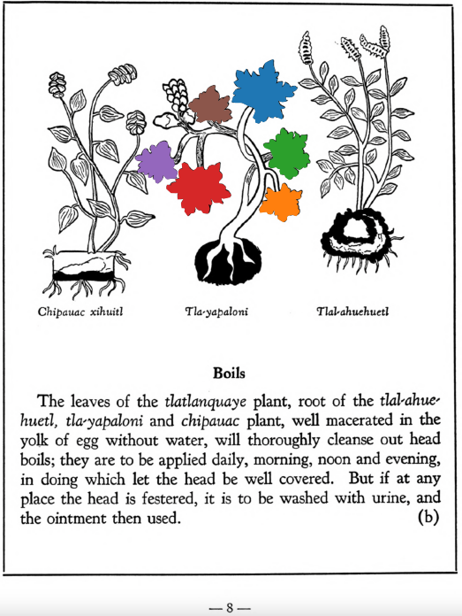
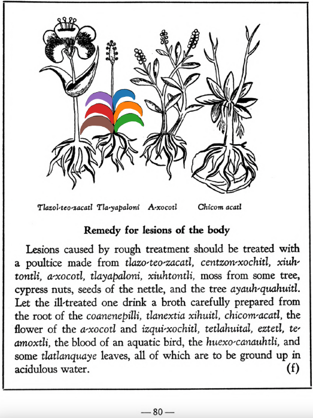

**Variants:**

- tlayapaloni

**Morphemes:**

- Tla/thing or something

## Subchapter 1b  

=== "English :flag_us:"
    **Boils.** The leaves of the [tlatlanquaye](Tlatlanquaye.md) plant, root of the [tlal-ahuehuetl](Tlal-ahuehuetl.md), [tla-yapaloni](Tla-yapaloni.md) and [chipauac](Chipauac xihuitl.md) plant, well macerated in the yolk of egg without water, will thoroughly cleanse out head boils; they are to be applied daily, morning, noon and evening, in doing which let the head be well covered. But if at any place the head is festered, it is to be washed with urine, and the ointment then used.  
    [https://archive.org/details/aztec-herbal-of-1552/page/8](https://archive.org/details/aztec-herbal-of-1552/page/8)  

=== "Español :flag_mx:"
    **Diviesos.**  Las hojas de la planta [tlatlanquaye](Tlatlanquaye.md), la raíz del [tlal-ahuehuetl](Tlal-ahuehuetl.md), [tla-yapaloni](Tla-yapaloni.md) y [chipauac](Chipauac xihuitl.md), bien maceradas en yema de huevo sin agua, limpian completamente los diviesos de la cabeza; deben aplicarse diariamente, por la mañana, al mediodía y por la tarde, cubriendo bien la cabeza al hacerlo. Pero si en alguna parte la cabeza está ulcerada, debe lavarse con orina y luego aplicarse el ungüento.  

## Subchapter 9f  

=== "English :flag_us:"
    **Remedy for lesions of the body.** Lesions caused by rough treatment should be treated with a poultice made from [tlazo-teo-zacatl](Tlazol-teo-zacatl.md), [centzon-xochitl](Centzon-xochitl.md), [xiuh-tontli](Xiuhtontli.md), [a-xocotl](A-xocotl.md), [tlayapaloni](Tla-yapaloni.md), [xiuhtontli](Xiuhtontli.md), moss from some tree, cypress nuts, seeds of the nettle, and the tree [ayauh-quahuitl](Ayauh-quahuitl.md). Let the ill-treated one drink a broth carefully prepared from the root of the [coanenepilli](Coanenepilli.md), tlanextia xihuitl, [chicom-catl](Chicom-acatl.md), the flower of the [a-xocotl](A-xocotl.md) and [izqui-xochitl](Izqui-xochitl.md), [tetlahuital](tetlahuitl v2.md), [eztetl](eztetl.md), [te-amoxtli](Te-amoxtli.md), the blood of an aquatic bird, the [huexo-canauhtli](huexo-canauhtli.md), and some [tlatlanquaye](Tlatlanquaye.md) leaves, all of which are to be ground up in acidulous water.  
    [https://archive.org/details/aztec-herbal-of-1552/page/80](https://archive.org/details/aztec-herbal-of-1552/page/80)  

=== "Español :flag_mx:"
    **Remedio para lesiones del cuerpo.** Las lesiones causadas por trato rudo deben tratarse con una cataplasma hecha de [tlazo-teo-zacatl](Tlazol-teo-zacatl.md), [centzon-xochitl](Centzon-xochitl.md), [xiuh-tontli](Xiuhtontli.md), [a-xocotl](A-xocotl.md), [tlayapaloni](Tla-yapaloni.md), [xiuhtontli](Xiuhtontli.md), musgo de algún árbol, nueces de ciprés, semillas de ortiga y el árbol [ayauh-quahuitl](Ayauh-quahuitl.md). El maltratado debe beber un caldo preparado cuidadosamente de la raíz del [coanenepilli](Coanenepilli.md), tlanextia xihuitl, [chicom-catl](Chicom-acatl.md), la flor del [a-xocotl](A-xocotl.md) y del [izqui-xochitl](Izqui-xochitl.md), [tetlahuital](tetlahuitl v2.md), [eztetl](eztetl.md), [te-amoxtli](Te-amoxtli.md), la sangre de un ave acuática, el [huexo-canauhtli](huexo-canauhtli.md), y algunas hojas de [tlatlanquaye](Tlatlanquaye.md), todo molido en agua acidulada.  

## Subchapter 9n  

=== "English :flag_us:"
    **Itch.** When this roughness of the skin affects the body, use the bark of the trees cherry, oak, cypress, tlanextia-quahuitl and blackberry; also the roots of the plants [tla-yapaloni](Tla-yapaloni.md), [tlal-ahuehuetl](Tlal-ahuehuetl.md), [tolohua-xihuitl](Tolohua xihuitl.md); the leaves of the oak-apple and the [tlatlanquaye](Tlatlanquaye.md); these are to be crushed, put in water with frankincense and yolk of egg, and boiled. The ulcerous or pustulent part is to be bathed with the lotion; afterwards the prepared medicament is to be applied.  
    [https://archive.org/details/aztec-herbal-of-1552/page/88](https://archive.org/details/aztec-herbal-of-1552/page/88)  

=== "Español :flag_mx:"
    **Sarna.** Cuando esta aspereza de la piel afecta el cuerpo, se usa la corteza de los árboles cerezo, roble, ciprés, tlanextia-quahuitl y zarzamora; también las raíces de las plantas [tla-yapaloni](Tla-yapaloni.md), [tlal-ahuehuetl](Tlal-ahuehuetl.md), [tolohua-xihuitl](Tolohua xihuitl.md); las hojas del agallón del roble y del [tlatlanquaye](Tlatlanquaye.md); todo esto se machaca, se pone en agua con copal y yema de huevo, y se hierve. La parte ulcerada o con pústulas se baña con esta loción; luego se aplica el medicamento preparado.  

## Subchapter 12a  

=== "English :flag_us:"
    **Infantile skin eruptions.** Phthiriasis, or the skin breaking out on infants, is cured by anointing the body with a poultice made from the seeds of the well known [michi-huauhtli](Michi-huauhtli.md), red incense, grain, which are to be burned; then the plant [tlatlanquaye](Tlatlanquaye.md), leaves of the [huitzitzil-xochitl](Huitzihtzil-xochitl.md), the root of the [tlal-ahuehuetl](Tlal-ahuehuetl.md) and [tla-yapaloni](Tla-yapaloni.md), laurel leaves, [xiuh-ecapatli](Eca-patli.md) leaves from which the acid water is to be drawn; let the boy also drink medicine made from white earth, the small white stones gathered from the bottom in flowing water, the stone [a-camallo-tetl](A-camallo-tetl v1.md) and [coltotzin](Coltotzin.md), the bush [tlal-mizquitl](Tlal-mizquitl.md), and points ground in water.  
    [https://archive.org/details/aztec-herbal-of-1552/page/113](https://archive.org/details/aztec-herbal-of-1552/page/113)  

=== "Español :flag_mx:"
    **Erupciones cutáneas infantiles.** La ftiriasis, o las erupciones en la piel de los niños, se cura untando el cuerpo con una cataplasma hecha de las semillas del conocido [michi-huauhtli](Michi-huauhtli.md), incienso rojo, grano, que deben quemarse; luego la planta [tlatlanquaye](Tlatlanquaye.md), hojas del [huitzitzil-xochitl](Huitzihtzil-xochitl.md), la raíz del [tlal-ahuehuetl](Tlal-ahuehuetl.md) y [tla-yapaloni](Tla-yapaloni.md), hojas de laurel, hojas de [xiuh-ecapatli](Eca-patli.md) de las cuales se extrae el agua ácida; que el niño también beba medicina hecha de tierra blanca, las pequeñas piedras blancas recogidas del fondo en aguas corrientes, la piedra [a-camallo-tetl](A-camallo-tetl v1.md) y [coltotzin](Coltotzin.md), el arbusto [tlal-mizquitl](Tlal-mizquitl.md), y puntas molidas en agua.  

  
Leaf traces by: Daniel H. Chitwood, Michigan State University, USA  
  
Leaf traces by: Lachlann Simms, Acadia University, Canada  
