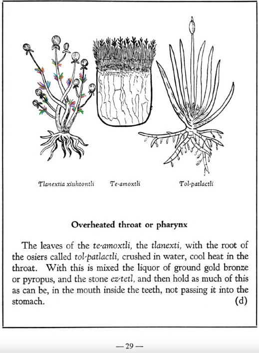

Variants: tlanexti, tlanexti-xiuhtontli, tlanextia, tlanextia xiuhtontli  

## Subchapter 5d  
**Overheated throat or pharynx.** The leaves of the [te-amoxtli](Te-amoxtli.md), the [tlanexti](Tlanextia xiuhtontli.md), with the root ofthe osiers called [tol-patlactli](Tol-patlactli.md), crushed in water, cool heat in the throat. With this is mixed the liquor of ground gold bronze or pyropus, and the stone [ez-tetl](eztetl.md), and then hold as much of this as can be, in the mouth inside the teeth, not passing it into the stomach.  
[https://archive.org/details/aztec-herbal-of-1552/page/29](https://archive.org/details/aztec-herbal-of-1552/page/29)  

## Subchapter 5f  
**Medicine to ease pain in the throat.** The liquor of the small herbs [tlanexti](Tlanextia xiuhtontli.md) and [teo-iztac-quilitl](Teo-iztaquilitl.md), that grow in stony places, crushed in honey with red and white earth, reduces pain in the throat, if lightly rubbed on with a finger inserted into the mouth.  
[https://archive.org/details/aztec-herbal-of-1552/page/31](https://archive.org/details/aztec-herbal-of-1552/page/31)  

## Subchapter 5i  
**Medicine to take away foul and fetid breath.** The root and leaves of the plant called [tlatlanquaye](Tlatlanquaye.md), red earth, white earth, the plants [temamatlatzin](Temamatlatzin.md) and [tlanextia xiuhtontli](Tlanextia xiuhtontli.md) ground and cooked in water with honey, suppress bad breath; the liquor, well strained, is further to be drunk before eating.  
[https://archive.org/details/aztec-herbal-of-1552/page/34](https://archive.org/details/aztec-herbal-of-1552/page/34)  

## Subchapter 7l  
**For a rumbling in the abdomen.** For one whose intestines rumble because of some flux in the abdomen, let him take by means of an ear syringe (clyster oriculario), a liquor prepared from leaves of the [tlatlanquaye](Tlatlanquaye.md) herb, the bark of the [quetzal-ylin](Quetzal-ylin.md), [iztac-oco-xochitl](Iztac oco-xochitl.md) leaves, and the herbs [tlanexti-xiuhtontli](Tlanextia xiuhtontli.md), [elo-zacatl](Elo-zacatl.md), the tree [tlanextia-quahuitl](Tlanextia quahuitl.md), ground up in acidulous water with ashes, a little honey, salt, pepper, alectorium and finally [pizietl](Piciyetl.md) or tobacco.  
[https://archive.org/details/aztec-herbal-of-1552/page/54](https://archive.org/details/aztec-herbal-of-1552/page/54)  

## Subchapter 7m  
**Abdominal chill.** This is removed by taking a drink made of the roots of the plants [copaliyac-xiuhtontli](Copaliyac-xiuhtontli.md), [tlanexti-xiuhtontli](Tlanextia xiuhtontli.md), [chichic-xihuitl](Chichic-xihuitl.md)and the [quauhtla huitz-quilitl](Quauhtla huitz-quilitl.md), with added Indian wine.  
[https://archive.org/details/aztec-herbal-of-1552/page/55](https://archive.org/details/aztec-herbal-of-1552/page/55)  

## Subchapter 11a  
**For recent parturition.** If the woman suffers difficulty in the bringing forth, then that she may give forth the fetus with little effort, let her drink medicines made from the bark of the tree[quauh-alahuac](Quauh-alahuac.md) and the plant [cihua-patli](Cihua-patli.md), the small stone [eztetl](eztetl.md), and the tail of the small animal called [tlaquatzin](tlaquatzin.md). Let her hold the plant [tlanextia](Tlanextia xiuhtontli.md) in her hand. Also the hairs and bone of an ape, the wings of an eagle, the tree [a-huexotl](Quetzal-ahuexotl.md), the skin of a deer, gall of a cock, also of a hare, and onions put in the sun are to be burned together; to these are to be added salt, the fruit we call [nochtli](Nochtli.md), and the pulque we call [octli](octli.md). The above are to be heated and used for anointing. Let her eat the cooked flesh of a wolf, and greenstone together with bright green pearl be bound on her back. She may also drink the juice of ground up kite and goose flesh, and the tail of the tlaquauzin, in our sweet wine; also take the root of the [xal-tomatl](Xal-tomatl.md), the tail of the [tlaquatzin](tlaquatzin.md), and leaves of the [cihua-patli](Cihua-patli.md), grind them up, and wet the womb. Also grind the tail of a suckling [tlaquatzin](tlaquatzin.md) in water, with the plant [cihua-patli](Cihua-patli.md), with which let the body be purged, it being given by a clyster.  
[https://archive.org/details/aztec-herbal-of-1552/page/106](https://archive.org/details/aztec-herbal-of-1552/page/106)  

  
Leaf traces by: Dan Chitwood, Michigan State University, USA  
