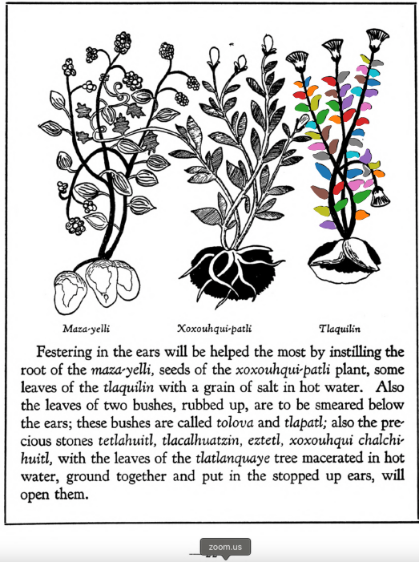

Variants: tlaquilin  

## Subchapter 3a  
**On festering in the ears, and deafness or stoppage.** Festering in the ears will be helped the most by instilling the root of the [maza-yelli](Maza-yelli.md), seeds of the [xoxouhqui-patli](xoxouhca-patli.md) plant, some leaves of the [tlaquilin](Tlaquilin.md) with a grain of salt in hot water. Also the leaves of two bushes, rubbed up, are to be smeared below the ears; these bushes are called [tolova](Tolohua_xihuitl.md) and [tlapatl](Tlapatl.md); also the precious stones [tetlahuitl](tetlahuitl_v2.md), [tlacalhuatzin](tlacal-huatzin.md), [eztetl](eztetl.md), xoxouhqui chalchi-huitl, with the leaves of the [tlatlanquaye](Tlatlanquaye.md) tree macerated in hot water, ground together and put in the stopped up ears, willopen them.  
[https://archive.org/details/aztec-herbal-of-1552/page/22](https://archive.org/details/aztec-herbal-of-1552/page/22)  

## Subchapter 9i  
**Skin eruptions.** The patient should first have the part affected bathed with urine; then let a plaster be applied made from [tlaquilin](Tlaquilin.md) shoots, [tlatlanquaye](Tlatlanquaye.md), the [quetzal-ylin](Quetzal-ylin.md) tree, the bark and leaves of the[a-quahuitl](A-quahuitl.md) crushed in water.  
[https://archive.org/details/aztec-herbal-of-1552/page/83](https://archive.org/details/aztec-herbal-of-1552/page/83)  

## Subchapter 9m  
**Festered places with worms.** When you see a festered spot gathering worms, grind together the leaves of the [quetzal-mizquitl](Quetzal-misquitl.md), [cimatl](Cimatl.md), [tlal-cacapol](Tlal-cacapol.md)and bramble bushes; also the root of the [tlaquilin](Tlaquilin.md) and the bark of the [xilo-xochitl](Xilo-xochitl.md), and put into our best wine; apply the liquor to the affected spot morning and evening. It will also be well to apply a medicament from bramble bushes, oak bark and leaves of the [quetzal-ylin](Quetzal-ylin.md), [tlal-patli](Tlal-patli.md), [quauh-patli](Quauh-patli.md), and [tlatlanquaye](Tlatlanquaye.md), with the [tlal-ahuehuetl](Tlal-ahuehuetl.md) root, ground up in water with yolk of egg. Use this twice daily, morning and evening, that purulence may dry up.  
[https://archive.org/details/aztec-herbal-of-1552/page/87](https://archive.org/details/aztec-herbal-of-1552/page/87)  

  
Leaf traces by: Dan Chitwood, Michigan State University, USA  
