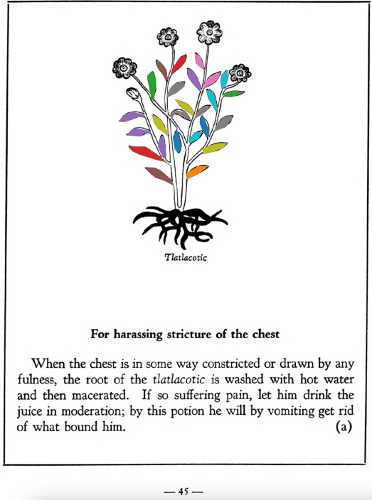

## Subchapter 6c  

=== "English :flag_us:"
    **For swollen jaws.** Swollen jaws are helped by taking in water the juice of crushed [tememetla](Te-memetla.md) leaves, the pith of the [te-xiyotl](Te-xiyotl.md) and white earth, the liquor whereof is sub-acid, with the gummy twigs bearing the glutinous tears we call [nocheztli](Nocheztli.md). For those who cannot open the mouth the root of the [tlatlacotic](Tlatlacotic.md) crushed in tepid water helps greatly; if he drinks this liquor, making him promptly vomit, the freed mucus will open the mouth.  
    [https://archive.org/details/aztec-herbal-of-1552/page/38](https://archive.org/details/aztec-herbal-of-1552/page/38)  

=== "Español :flag_mx:"
    **Para las mandíbulas hinchadas.** Las mandíbulas hinchadas se alivian tomando en agua el jugo de hojas machacadas de [tememetla](Te-memetla.md), la médula del [te-xiyotl](Te-xiyotl.md) y tierra blanca, cuyo licor es subácido, junto con las ramas gomosas que dan las lágrimas pegajosas que llamamos [nocheztli](Nocheztli.md). Para quienes no pueden abrir la boca, ayuda mucho la raíz del [tlatlacotic](Tlatlacotic.md) triturada en agua tibia; si bebe este licor y vomita de inmediato, el moco liberado abrirá la boca.  

## Subchapter 7a  

=== "English :flag_us:"
    **For harassing stricture of the chest.** When the chest is in some way constricted or drawn by any fulness, the root of the [tlatlacotic](Tlatlacotic.md) is washed with hot water and then macerated. If so suffering pain, let him drink the juice in moderation; by this potion he will by vomiting get rid of what bound him.  
    [https://archive.org/details/aztec-herbal-of-1552/page/45](https://archive.org/details/aztec-herbal-of-1552/page/45)  

=== "Español :flag_mx:"
    **Para la opresión molesta del pecho.** Cuando el pecho está de alguna forma oprimido o tenso por alguna plenitud, la raíz del [tlatlacotic](Tlatlacotic.md) se lava con agua caliente y luego se macera. Si se siente dolor, que beba el jugo con moderación; con esta poción vomitará y se librará de lo que lo constreñía.  

## Subchapter 9q  

=== "English :flag_us:"
    **Those struck by lightning.** Let one struck by a thunderbolt drink a potion well prepared from leaves of trees, namely the [ayauh-quahuitl](Ayauh-quahuitl.md), [tepaquilti quahuitl](tepaquilti quahuitl.md), very green cypress, the bush [iztauh-yatl](Iztauyattl.md), the herbs [quauh-yyauhtli](Quauh-yyauhtli.md) and [te-amoxtli](Te-amoxtli.md). But however the drink is to be given, let it be heated.  Let the body also be anointed with a plaster made of the herbs [papalo-quilitl](Papalo-quilitl.md), [tlal-ecapatli](Tlal-ecapatli.md), [quauh-yyauhtli](Quauh-yyauhtli.md), [tlatlanquaye](Tlatlanquaye.md), huitbitzil xochitil, [iztac-oco-xochitl](Iztac oco-xochitl.md), and in addition all the plants upon which the lightning struck. A few days later lethim drink water into which white frankincense is thrown. The water is boiled with white and whitish incense, with the burned bones of a fox added. Also mix some Indian wine with the above. Afterwards you will instill into the nostrils a medicine made of white pearl, the root [tlatlacotic](Tlatlacotic.md), and all plants growing in a garden that has been burned over. Let also be suffumigated by white incense thrown upon the coals, the wax ointment we call xochi-oco-tzotl, and the good odor of the herb [quauh-yyauhtli](Quauh-yyauhtli.md).  
    [https://archive.org/details/aztec-herbal-of-1552/page/91](https://archive.org/details/aztec-herbal-of-1552/page/91)  

=== "Español :flag_mx:"
    **Golpeados por un rayo.** Quien haya sido golpeado por un rayo debe beber una poción bien preparada con hojas de árboles, a saber: [ayauh-quahuitl](Ayauh-quahuitl.md), [tepaquilti quahuitl](tepaquilti quahuitl.md), ciprés muy verde, el arbusto [iztauh-yatl](Iztauyattl.md), las hierbas [quauh-yyauhtli](Quauh-yyauhtli.md) y [te-amoxtli](Te-amoxtli.md). Pero sea como sea que se le dé a beber, debe calentarse. También se unta el cuerpo con un emplasto hecho de las hierbas [papalo-quilitl](Papalo-quilitl.md), [tlal-ecapatli](Tlal-ecapatli.md), [quauh-yyauhtli](Quauh-yyauhtli.md), [tlatlanquaye](Tlatlanquaye.md), huitbitzil xochitil, [iztac-oco-xochitl](Iztac oco-xochitl.md), y además todas las plantas sobre las que cayó el rayo. Unos días después debe beber agua en la que se ha arrojado copal blanco. El agua se hierve con incienso blanco y blanquecino, con huesos quemados de zorro añadidos. También se mezcla algo de vino indígena con lo anterior. Después se le instila en las narices un medicamento hecho de perla blanca, la raíz [tlatlacotic](Tlatlacotic.md), y todas las plantas que crecen en un jardín quemado. También debe ser sahumado con copal blanco sobre las brasas, el ungüento de cera que llamamos xochi-oco-tzotl, y el buen aroma de la hierba [quauh-yyauhtli](Quauh-yyauhtli.md).  

## Subchapter 10a  

=== "English :flag_us:"
    **Epilepsy.** Against this, recently aroused, there will serve the small stones found in a hawk’s stomach, the bird [huactli](huactli.md) and the cock; with the root of the [quetzal-atzonyatl](Quetzal-atzonyatl.md), deer’s horn, whitish and also white incense, the hair of a corpse, the incinerated flesh of a mole shut in a jar, all which are to be well ground up in hot water. Let the man affected drink the liquor that he may vomit, before which it should be well for him to drink of the crushed root of the bush called [tlatlacotic](Tlatlacotic.md). Observe the time when the epilepsy is to come on, for then the epileptic is to be instantly raised and the cartilage and sides punctured. Arising let him drink camnum gall, at the same time the head is given a poultice made of the [quetzal-atzo-yatl](Quetzal-atzonyatl.md) and [te-tzilin](Te-tzitzilin.md) leaves, and the herb or bush [acoco-xihuitl](Acoco-xihuitl.md), all ground up in water. Let him eat the brain of a wolf and a weasel, boiled. Also fumigation with the odor of a mouse’s nest consumed over the coals, whitish incense and the feathers of a vulture.  
    [https://archive.org/details/aztec-herbal-of-1552/page/94](https://archive.org/details/aztec-herbal-of-1552/page/94)  

=== "Español :flag_mx:"
    **Epilepsia.** Contra esto, cuando se ha presentado recientemente, servirán las piedrecillas que se hallan en el estómago de un halcón, el ave [huactli](huactli.md) y el gallo; con la raíz del [quetzal-atzonyatl](Quetzal-atzonyatl.md), cuerno de venado, incienso blanquecino y también blanco, el cabello de un cadáver, la carne incinerada de un topo encerrada en un frasco, todo lo cual debe molerse bien en agua caliente. Que el afectado beba el licor para que vomite, antes de lo cual le conviene beber la raíz machacada del arbusto llamado [tlatlacotic](Tlatlacotic.md). Observar el momento en que se va a presentar la epilepsia, pues en ese instante se debe levantar al epiléptico de inmediato y punzarle el cartílago y los costados. Al levantarse debe beber hiel de camnum, al mismo tiempo que se le aplica en la cabeza un emplasto hecho con hojas de [quetzal-atzo-yatl](Quetzal-atzonyatl.md) y [te-tzilin](Te-tzitzilin.md), y con la hierba o arbusto [acoco-xihuitl](Acoco-xihuitl.md), todo molido en agua. Que coma el cerebro de un lobo y de una comadreja, hervidos. También se le hace una fumigación con el olor de un nido de ratón quemado sobre las brasas, incienso blanquecino y plumas de buitre.  

## Subchapter 10e  

=== "English :flag_us:"
    **Against stupidity of mind.** Let one who is possessed of such a mind drink the crushed roots of the [tlatlacotic](Tlatlacotic.md) in hot water, that he may vomit. A few days later let the roots and flowers of the [yollo-xochitl](Yollo-xochitl.md) and [cacaua-xochitl](Cacaua-xochitl.md) be crushed in water, and let him drink the liquor before eating, wherewith the evil humor in the chest will be largely driven out. Third: let the small stones in the stomachs of the birds [xiuhquechol-tototl](xiuh-quechol-tototl.md) and [tlapa-tototl](tlapal-tototl.md), the [tetlahuitl](tetlahuitl v2.md), the precious stones [tlacal-huatzin](tlacal-huatzin.md), [eztetl](eztetl.md) and pearl be ground together in water; after this divide the liquor into three parts, one of which he drinks and the second is at once poured on his head. Having done this, let him carry in his hands the stone found in the stomach of the [huactli](huactli.md) or night-owl together with its gall-bladder; with this and the drink he will come to himself and his sanity of mind be restored. Let his head also be anointed with the brain of a raven and a dove’s feathers crushed and put in water with human hairs. On his neck let him carry the stone found in a swallow’s stomach.  
    [https://archive.org/details/aztec-herbal-of-1552/page/98](https://archive.org/details/aztec-herbal-of-1552/page/98)  

=== "Español :flag_mx:"
    **Contra la torpeza de entendimiento.** Quien tenga esta condición debe beber las raíces machacadas del [tlatlacotic](Tlatlacotic.md) en agua caliente, para que vomite. Unos días después, que se trituren las raíces y flores del [yollo-xochitl](Yollo-xochitl.md) y [cacaua-xochitl](Cacaua-xochitl.md) en agua, y que beba el licor antes de comer, con lo cual se expulsará en gran parte el humor maligno del pecho. En tercer lugar: que se muelan en agua las piedrecillas del estómago de las aves [xiuhquechol-tototl](xiuh-quechol-tototl.md) y [tlapa-tototl](tlapal-tototl.md), el [tetlahuitl](tetlahuitl v2.md), las piedras preciosas [tlacal-huatzin](tlacal-huatzin.md), [eztetl](eztetl.md) y perla; después de esto se divide el licor en tres partes: una se bebe, la segunda se vierte de inmediato sobre su cabeza. Habiendo hecho esto, debe llevar en las manos la piedra hallada en el estómago del [huactli](huactli.md) o tecolote junto con su vesícula biliar; con esto y la bebida recobrará el juicio y se restaurará su cordura. También debe untarse la cabeza con el cerebro de un cuervo y plumas de paloma molidas y puestas en agua con cabellos humanos. En su cuello debe llevar la piedra hallada en el estómago de una golondrina.  

  
Leaf traces by: Jimena Jazmin Hurtado Olvera, Laboratory of Agrigenomic Sciences, ENES Unidad León, México  
