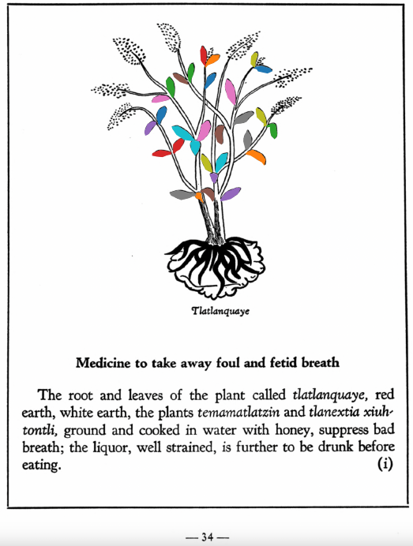
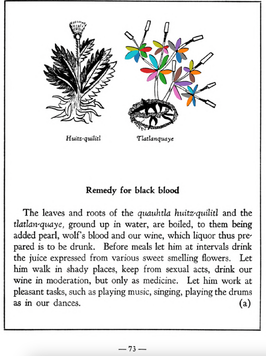

Variants: tlatlan-quaye, tlatlanquaye  

## Subchapter 1b  
**Boils.** The leaves of the [tlatlanquaye](Tlatlanquaye.md) plant, root of the [tlal-ahuehuetl](Tlal-ahuehuetl.md), [tla-yapaloni](Tla-yapaloni.md) and [chipauac](Chipauac xihuitl.md) plant, well macerated in the yolk of egg without water, will thoroughly cleanse out head boils; they are to be applied daily, morning, noon and evening, in doing which let the head be well covered. But if at any place the head is festered, it is to be washed with urine, and the ointment then used.  
[https://archive.org/details/aztec-herbal-of-1552/page/8](https://archive.org/details/aztec-herbal-of-1552/page/8)  

## Subchapter 3a  
**On festering in the ears, and deafness or stoppage.** Festering in the ears will be helped the most by instilling the root of the [maza-yelli](Maza-yelli.md), seeds of the [xoxouhqui-patli](xoxouhca-patli.md) plant, some leaves of the [tlaquilin](Tlaquilin.md) with a grain of salt in hot water. Also the leaves of two bushes, rubbed up, are to be smeared below the ears; these bushes are called [tolova](Tolohua xihuitl.md) and [tlapatl](Tlapatl.md); also the precious stones [tetlahuitl](tetlahuitl v2.md), [tlacalhuatzin](tlacal-huatzin.md), [eztetl](eztetl.md), xoxouhqui chalchi-huitl, with the leaves of the [tlatlanquaye](Tlatlanquaye.md) tree macerated in hot water, ground together and put in the stopped up ears, willopen them.  
[https://archive.org/details/aztec-herbal-of-1552/page/22](https://archive.org/details/aztec-herbal-of-1552/page/22)  

## Subchapter 5i  
**Medicine to take away foul and fetid breath.** The root and leaves of the plant called [tlatlanquaye](Tlatlanquaye.md), red earth, white earth, the plants [temamatlatzin](Temamatlatzin.md) and [tlanextia xiuhtontli](Tlanextia xiuhtontli.md) ground and cooked in water with honey, suppress bad breath; the liquor, well strained, is further to be drunk before eating.  
[https://archive.org/details/aztec-herbal-of-1552/page/34](https://archive.org/details/aztec-herbal-of-1552/page/34)  

## Subchapter 6a  
**Against the hiccups.** For the hiccups take the root of the bush cohuatli, leaves of the plant [mexix-quilitl](Mexix-quilitl.md), bark of the red pine, leaves of the aromatic [tlatlanquaye](Tlatlanquaye.md) plant, grind them in water and boil them; when well boiled mix white honey and let him drink moderately. Throw white frankincense and [xochi-ocotzotl](xochi-ocotzotl.md) on the coals, soaking a pad of cotton with the odor, and with which the chest is to be heated. Leaves of cypress also, with the herbs [papalo-quilitl](Papalo-quilitl.md) and [yyauhtli](Y-yauhtli.md), are to be macerated in water, with the heated liquor whereof the chest is to be rubbed.  
[https://archive.org/details/aztec-herbal-of-1552/page/36](https://archive.org/details/aztec-herbal-of-1552/page/36)  

## Subchapter 7f  
**Against animalcula that descend into a man’s stomach.** When one swallows animalcula, crush Indian beans and place in his mouth; then let him enter a well heated bath. When he feels the heat thoroughly, let him sip bitter water, without taking it down. Then if God wills he will eliminate the animalculum through the mouth by vomiting, or through the abdomen behind; or it may die there, and then when it is ejected, let him drink [tlatlanquaye](Tlatlanquaye.md)crushed in the finest Indian wine.  
[https://archive.org/details/aztec-herbal-of-1552/page/50](https://archive.org/details/aztec-herbal-of-1552/page/50)  

## Subchapter 7i  
**Tumor of the stomach.** For a tumor of the abdomen or stomach, make a preparation from the leaves of the [xiuhtontli](Xiuhtontli.md) and the root of the [tlatlanquaye](Tlatlanquaye.md), the [copaliyac-xiuhtontli](Copaliyac-xiuhtontli.md) and the alectorium or gem found in the maw of a cock, ground together in the finest Indian wine; also let him be given through the rectum a purge for the bowel made from the root of the [cococ-xiuhuitl](Cococ-xihuitl.md), Indian pepper, salt, nitre and the alectorium.  
[https://archive.org/details/aztec-herbal-of-1552/page/52](https://archive.org/details/aztec-herbal-of-1552/page/52)  

## Subchapter 7l  
**For a rumbling in the abdomen.** For one whose intestines rumble because of some flux in the abdomen, let him take by means of an ear syringe (clyster oriculario), a liquor prepared from leaves of the [tlatlanquaye](Tlatlanquaye.md) herb, the bark of the [quetzal-ylin](Quetzal-ylin.md), [iztac-oco-xochitl](Iztac oco-xochitl.md) leaves, and the herbs [tlanexti-xiuhtontli](Tlanextia xiuhtontli.md), [elo-zacatl](Elo-zacatl.md), the tree [tlanextia-quahuitl](Tlanextia quahuitl.md), ground up in acidulous water with ashes, a little honey, salt, pepper, alectorium and finally [pizietl](Piciyetl.md) or tobacco.  
[https://archive.org/details/aztec-herbal-of-1552/page/54](https://archive.org/details/aztec-herbal-of-1552/page/54)  

## Subchapter 8k  
**Against lassitude.** One fatigued will be restored if the feet be bathed in choice liquor, with the [ahuiyac-xihuitl](Ahuiyac-xihuitl.md) or [tlatlanquaye](Tlatlanquaye.md), [tlatlaolton](Tlatlaolton.md), [itzcuin-patli](Itzquin-patli.md), [xiuh-ecapatli](Eca-patli.md), [iztauh-yatl](Iztauyattl.md), the [huitzihtzil-xochitl](Huitzihtzil-xochitl.md)flower, and the stones [tetlahuitl](tetlahuitl v2.md), [tlaca-huatzin](tlacal-huatzin.md) and [eztetl](eztetl.md), to be crushed in hot water.  
[https://archive.org/details/aztec-herbal-of-1552/page/66](https://archive.org/details/aztec-herbal-of-1552/page/66)  

## Subchapter 9a  
**Remedy for black blood.** The leaves and roots of the [quauhtla huitz-quilitl](Quauhtla huitz-quilitl.md) and the[tlatlan-quaye](Tlatlanquaye.md), ground up in water, are boiled, to them being added pearl, wolf’s blood and our wine, which liquor thus prepared is to be drunk. Before meals let him at intervals drink the juice expressed from various sweet smelling flowers. Let him walk in shady places, keep from sexual acts, drink our wine in moderation, but only as medicine. Let him work at pleasant tasks, such as playing music, singing, playing the drums as in our dances.  
[https://archive.org/details/aztec-herbal-of-1552/page/73](https://archive.org/details/aztec-herbal-of-1552/page/73)  

## Subchapter 9f  
**Remedy for lesions of the body.** Lesions caused by rough treatment should be treated with a poultice made from [tlazo-teo-zacatl](Tlazol-teo-zacatl.md), [centzon-xochitl](Centzon-xochitl.md), [xiuh-tontli](Xiuhtontli.md), [a-xocotl](A-xocotl.md), [tlayapaloni](Tla-yapaloni.md), [xiuhtontli](Xiuhtontli.md), moss from some tree, cypress nuts, seeds of the nettle, and the tree [ayauh-quahuitl](Ayauh-quahuitl.md). Let the ill-treated one drink a broth carefully prepared from the root of the [coanenepilli](Coanenepilli.md), tlanextia xihuitl, [chicom-catl](Chicom-acatl.md), the flower of the [a-xocotl](A-xocotl.md) and [izqui-xochitl](Izqui-xochitl.md), [tetlahuital](tetlahuitl v2.md), [eztetl](eztetl.md), [te-amoxtli](Te-amoxtli.md), the blood of an aquatic bird, the [huexo-canauhtli](huexo-canauhtli.md), and some [tlatlanquaye](Tlatlanquaye.md) leaves, all of which are to be ground up in acidulous water.  
[https://archive.org/details/aztec-herbal-of-1552/page/80](https://archive.org/details/aztec-herbal-of-1552/page/80)  

## Subchapter 9g  
**For ringworm and tetter.** For one laboring with this scaly disease, let there be ground together and set over coals the bark of the cherry, of the incense bearing[quauh-xiyotl](Quauh-xiyotl.md) tree, the apple, the flowers of the [topozan](Topozan.md) and [cacalo-xochitl](Cacalo-xochitl.md), oak roots, cypress nuts, leaves of the plants[tlatlanquaye](Tlatlanquaye.md), [quauh-yayahual](Quauh-yayahual.md), the herbs [tepe-chian](Tepe-chian.md), [coyo-xihuitl](Coyo-xihuitl.md), [a-quahuitl](A-quahuitl.md), cedar nuts and leaves; with these when heated let him bathe himself, and the affected part be rubbed with the burned pine, with which, and all the above, let him be rubbed.  
[https://archive.org/details/aztec-herbal-of-1552/page/81](https://archive.org/details/aztec-herbal-of-1552/page/81)  

## Subchapter 9h  
**For recurrent disease.** Let one relapsing in sickness drink, before a meal, a little of the latex like milk, expressed from the [teo-amatl](Teo-amatl.md), that he may vomit. On the third or fourth day let him drink a potion formed from [tonatiuh-yxiuh](Tonatiuh yxiuh v1.md) root, [tlatlanquaye](Tlatlanquaye.md) and also [tlanexti-yxiuh](Tlanextia-yxiuh.md) root, ground up in tepid water. Third let him drink of the [cuecuetz-patli](Cuecuetz-patli.md) root crushed in our wine. Let him drink this as he enters the bath, and then on coming out be anointed with the liquor of ground [teo-amatl](Teo-amatl.md) roots. The bowel should be twice cleared with a clyster, first with a liquor from [ohua-xocoyolin](Ohua-xoxocoyolin.md)root crushed in hot water, and this even though he partakes of some food; this healthful juice will throw out pus from the abdomen. The second time, a few days later, made of the intoxicating plant we call [piciyetl](Piciyetl.md), salt, our black pepper, and light colored pepper.  
[https://archive.org/details/aztec-herbal-of-1552/page/82](https://archive.org/details/aztec-herbal-of-1552/page/82)  

## Subchapter 9i  
**Skin eruptions.** The patient should first have the part affected bathed with urine; then let a plaster be applied made from [tlaquilin](Tlaquilin.md) shoots, [tlatlanquaye](Tlatlanquaye.md), the [quetzal-ylin](Quetzal-ylin.md) tree, the bark and leaves of the[a-quahuitl](A-quahuitl.md) crushed in water.  
[https://archive.org/details/aztec-herbal-of-1552/page/83](https://archive.org/details/aztec-herbal-of-1552/page/83)  

## Subchapter 9m  
**Festered places with worms.** When you see a festered spot gathering worms, grind together the leaves of the [quetzal-mizquitl](Quetzal-misquitl.md), [cimatl](Cimatl.md), [tlal-cacapol](Tlal-cacapol.md)and bramble bushes; also the root of the [tlaquilin](Tlaquilin.md) and the bark of the [xilo-xochitl](Xilo-xochitl.md), and put into our best wine; apply the liquor to the affected spot morning and evening. It will also be well to apply a medicament from bramble bushes, oak bark and leaves of the [quetzal-ylin](Quetzal-ylin.md), [tlal-patli](Tlal-patli.md), [quauh-patli](Quauh-patli.md), and [tlatlanquaye](Tlatlanquaye.md), with the [tlal-ahuehuetl](Tlal-ahuehuetl.md) root, ground up in water with yolk of egg. Use this twice daily, morning and evening, that purulence may dry up.  
[https://archive.org/details/aztec-herbal-of-1552/page/87](https://archive.org/details/aztec-herbal-of-1552/page/87)  

## Subchapter 9n  
**Itch.** When this roughness of the skin affects the body, use the bark of the trees cherry, oak, cypress, tlanextia-quahuitl andblackberry; also the roots of the plants [tla-yapaloni](Tla-yapaloni.md), [tlal-ahuehuetl](Tlal-ahuehuetl.md), [tolohua-xihuitl](Tolohua xihuitl.md); the leaves of the oak-apple and the [tlatlanquaye](Tlatlanquaye.md); these are to be crushed, put in water with frankincense and yolk of egg, and boiled. The ulcerous or pustulent part is to be bathed with the lotion; afterwards the prepared medicament is to be applied.  
[https://archive.org/details/aztec-herbal-of-1552/page/88](https://archive.org/details/aztec-herbal-of-1552/page/88)  

## Subchapter 9q  
**Those struck by lightning.** Let one struck by a thunderbolt drink a potion well prepared from leaves of trees, namely the [ayauh-quahuitl](Ayauh-quahuitl.md), [tepaquilti quahuitl](tepaquilti quahuitl.md), very green cypress, the bush [iztauh-yatl](Iztauyattl.md), the herbs[quauh-yyauhtli](Quauh-yyauhtli.md) and [te-amoxtli](Te-amoxtli.md). But however the drink is to be given, let it be heated.  Let the body also be anointed with a plaster made of the herbs [papalo-quilitl](Papalo-quilitl.md), [tlal-ecapatli](Tlal-ecapatli.md), [quauh-yyauhtli](Quauh-yyauhtli.md), [tlatlanquaye](Tlatlanquaye.md), huitbitzil xochitil, [iztac-oco-xochitl](Iztac oco-xochitl.md), and in addition all the plants upon which the lightning struck. A few days later lethim drink water into which white frankincense is thrown. The water is boiled with white and whitish incense, with the burned bones of a fox added. Also mix some Indian wine with the above. Afterwards you will instill into the nostrils a medicine made of white pearl, the root [tlatlacotic](Tlatlacotic.md), and all plants growing in a garden that has been burned over. Let also be suffumigated by white incense thrown upon the coals, the wax ointment we call [xochi-oco-tzotl](xochi-ocotzotl.md), and the good odor of the herb [quauh-yyauhtli](Quauh-yyauhtli.md).  
[https://archive.org/details/aztec-herbal-of-1552/page/91](https://archive.org/details/aztec-herbal-of-1552/page/91)  

## Subchapter 12a  
**Infantile skin eruptions.** Phthiriasis, or the skin breaking out on infants, is cured by anointing the body with a poultice made from the seeds of the well known [michi-huauhtli](Michi-huauhtli.md), red incense, grain, which are to be burned; then the plant [tlatlanquaye](Tlatlanquaye.md), leaves of the [huitzitzil-xochitl](Huitzihtzil-xochitl.md), the root of the [tlal-ahuehuetl](Tlal-ahuehuetl.md) and [tla-yapaloni](Tla-yapaloni.md), laurel leaves, [xiuh-ecapatli](Eca-patli.md) leaves from which the acid water is to be drawn; let the boy also drink medicine made from white earth, the small white stones gathered from the bottom in flowing water, the stone[a-camallo-tetl](a-camallo-tetl v2.md) and [coltotzin](Coltotzin.md), the bush [tlal-mizquitl](Tlal-mizquitl.md), and points ground in water.  
[https://archive.org/details/aztec-herbal-of-1552/page/113](https://archive.org/details/aztec-herbal-of-1552/page/113)  

  
Leaf traces by: Dan Chitwood, Michigan State University, USA  
  
Leaf traces by: Kylie DeViller, Acadia University, Canada  
