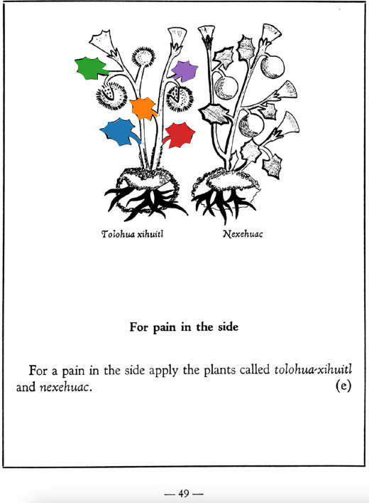

Variants: tolohua, tolohua-xihuitl, tolova, tolova-xihuitl  

## Subchapter 3a  
**On festering in the ears, and deafness or stoppage.** Festering in the ears will be helped the most by instilling the root of the [maza-yelli](Maza-yelli.md), seeds of the [xoxouhqui-patli](xoxouhca-patli.md) plant, some leaves of the [tlaquilin](Tlaquilin.md) with a grain of salt in hot water. Also the leaves of two bushes, rubbed up, are to be smeared below the ears; these bushes are called [tolova](Tolohua xihuitl.md) and [tlapatl](Tlapatl.md); also the precious stones [tetlahuitl](tetlahuitl v2.md), [tlacalhuatzin](tlacal-huatzin.md), [eztetl](eztetl.md), xoxouhqui chalchi-huitl, with the leaves of the [tlatlanquaye](Tlatlanquaye.md) tree macerated in hot water, ground together and put in the stopped up ears, willopen them.  
[https://archive.org/details/aztec-herbal-of-1552/page/22](https://archive.org/details/aztec-herbal-of-1552/page/22)  

## Subchapter 6f  
**For scrofulous tumors.** One scrofulous is relieved of the ailment if a plaster is applied to the neck, made of plants growing in a burned over thicket of bushes or reeds, the [tolova-xihuitl](Tolohua xihuitl.md), the [tonatiuh yxiuh](Tonatiuh yxiuh v1.md), the root of the [tecpatl](Tecpatl.md), and the leaves of bramble bushes; crush these with the stone found in a swallow’s stomach, with his blood.  
[https://archive.org/details/aztec-herbal-of-1552/page/41](https://archive.org/details/aztec-herbal-of-1552/page/41)  

## Subchapter 6g  
**For glandular or spongy swellings.** The tumors are to be cut with a small sword or knife, which done the matter is carefully cleared out, and a plaster applied to the cut. This then is to consist of the small plant [tonatiuh yxiuh](Tonatiuh yxiuh v1.md) that grows in the summer, and [tolohua](Tolohua xihuitl.md) leaves crushed in the yolk of an egg.  
[https://archive.org/details/aztec-herbal-of-1552/page/42](https://archive.org/details/aztec-herbal-of-1552/page/42)  

## Subchapter 7e  
**For pain in the side.** For a pain in the side apply the plants called [tolohua-xihuitl](Tolohua xihuitl.md)and [nexehuac](Nexehuac.md).  
[https://archive.org/details/aztec-herbal-of-1552/page/49](https://archive.org/details/aztec-herbal-of-1552/page/49)  

## Subchapter 8a  
**Curation of the pubis.** When this part feels pain, let it be anointed with liquor expressed and prepared from the bark and leaves of the tree[macpal-xochitl](Macpal-xochitl.md), the thorny plants [tolohua-xihuitl](Tolohua xihuitl.md) and [xiuh-tontli](Xiuhtontli.md), Indian knives, flints, the fruit we call [te-tzapotl](Te-tzapotl.md) and the stone [te-xoxoctli](te-xoxoctli.md), ground up in the blood of a swallow, a lizard and a mouse. You must remember to heat this liquid. Also if a tumor or the pain burns severely, do not hesitate on section; the cut you must purify and anoint with a liquid drawn from the roots of the herb [tlal-huaxin](Tlal-huaxin.md), ground up in yolk of egg.  
[https://archive.org/details/aztec-herbal-of-1552/page/57](https://archive.org/details/aztec-herbal-of-1552/page/57)  

## Subchapter 8i  
**Cracks in the soles of the feet.** Cracks in the soles of the feet are cured by a salve prepared from the herb [tolohua-xihuitl](Tolohua xihuitl.md), blood of a cock, resin, the resinous humor we call [hoxitl](hoxitl.md), the which muist be heated.  
[https://archive.org/details/aztec-herbal-of-1552/page/64](https://archive.org/details/aztec-herbal-of-1552/page/64)  

## Subchapter 8j  
**Lesions in the feet.** For cut feet prepare these herbs: [tlal-ecapatli](Tlal-ecapatli.md), [coyo-xihuitl](Coyo-xihuitl.md), [iztauh-yatl](Iztauyattl.md), [tepe-chian](Tepe-chian.md), [a-chilli](A-chilli.md), [xiuh-ecapatli](Eca-patli.md), [quauh-yyauhtli](Quauh-yyauhtli.md), [quetzal-xoxouhca-patli](Quetzal-xoxouca-patli.md), [tzotzotlani](Quetzal-xoxouhca-patli tzotzotlani.md), the flower of the [cacau-xochitl](Cacaua-xochitl.md) and the [piltzin-tecouh-xochitl](Piltzinte-couh-xochitl.md), with the leaves of the [eca-patli](Eca-patli.md) and the [itzcuin-patli](Itzquin-patli.md), the stones [tlacal-huatzin](tlacal-huatzin.md), [eztetl](eztetl.md) and [tetlahuitl](tetlahuitl v2.md), pale colored earth. Then divide all this into three parts. Put some in a basin over the coals or fire that it may heat, in water, and put the feet into the hot water in the basin. Let the fire placed at the feet lower somewhat, that it may not fall onto them; the feet are to be wrapped in a cloth. The following day put our ointment called [xochi-ocotzotl](xochi-ocotzotl.md), with white frankincense, into the fire, that the feet may improve by the odor and the heat; also let the seeds of the herb called [xe-xihuitl](Xe-xihuitl.md) be ground up and put pulverized into hot water to apply to the feet. Third, apply the herb[tolohua-xihuitl](Tolohua xihuitl.md)and brambles ground up in hot water.  
[https://archive.org/details/aztec-herbal-of-1552/page/65](https://archive.org/details/aztec-herbal-of-1552/page/65)  

## Subchapter 9n  
**Itch.** When this roughness of the skin affects the body, use the bark of the trees cherry, oak, cypress, tlanextia-quahuitl andblackberry; also the roots of the plants [tla-yapaloni](Tla-yapaloni.md), [tlal-ahuehuetl](Tlal-ahuehuetl.md), [tolohua-xihuitl](Tolohua xihuitl.md); the leaves of the oak-apple and the [tlatlanquaye](Tlatlanquaye.md); these are to be crushed, put in water with frankincense and yolk of egg, and boiled. The ulcerous or pustulent part is to be bathed with the lotion; afterwards the prepared medicament is to be applied.  
[https://archive.org/details/aztec-herbal-of-1552/page/88](https://archive.org/details/aztec-herbal-of-1552/page/88)  

  
Leaf traces by: Noé García, UNAM ENES León, México  
