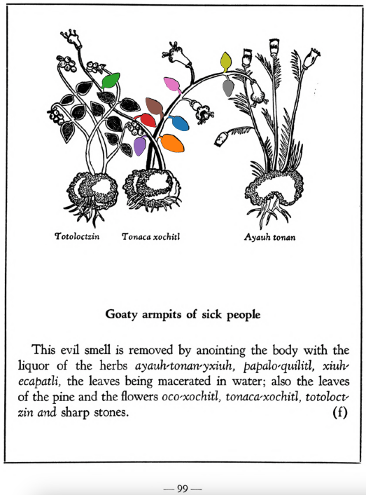

Variants: tonaca-xochitl  

## Subchapter 10f  
**Goaty armpits of sick people.** This evil smell is removed by anointing the body with the liquor of the herbs[ayauh-tonan-yxiuh](Ayauh-tonan-yxiuh.md), [papalo-quilitl](Papalo-quilitl.md), [xiuh-ecapatli](Eca-patli.md), the leaves being macerated in water; also the leaves of the pine and the flowers[oco-xochitl](Oco-xochitl.md), [tonaca-xochitl](Tonaca-xochitl.md), [totoloctzin](Totoloctzin.md)and sharp stones.  
[https://archive.org/details/aztec-herbal-of-1552/page/99](https://archive.org/details/aztec-herbal-of-1552/page/99)  

  
Leaf traces by: Zoë Migicovsky, Acadia University, Canada  
