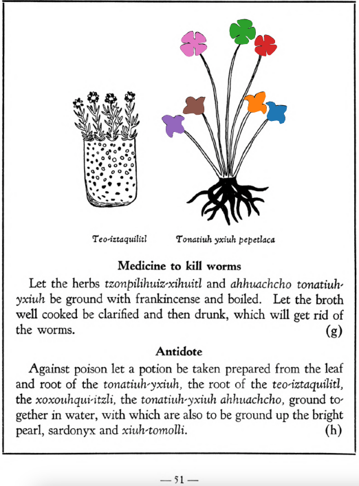

Variants: tonatiuh-yxiuh  

## Subchapter 7h  
**Antidote.** Against poison let a potion be taken prepared from the leaf and root of the [tonatiuh-yxiuh](Tonatiuh_yxiuh_v2.md), the root of the [teo-iztaquilitl](Teo-iztaquilitl.md), the [xoxouhqui-itzli](xoxouhqui-itzli.md), the [tonatiuh-yxiuh](Tonatiuh_yxiuh_v2.md) ahhuachcho, ground together in water, with which are also to be ground up the bright pearl, sardonyx and [xiuh-tomolli](xiuh-tomolli.md).  
[https://archive.org/details/aztec-herbal-of-1552/page/51](https://archive.org/details/aztec-herbal-of-1552/page/51)  

  
Leaf traces by: Noé García, UNAM ENES León, México  
