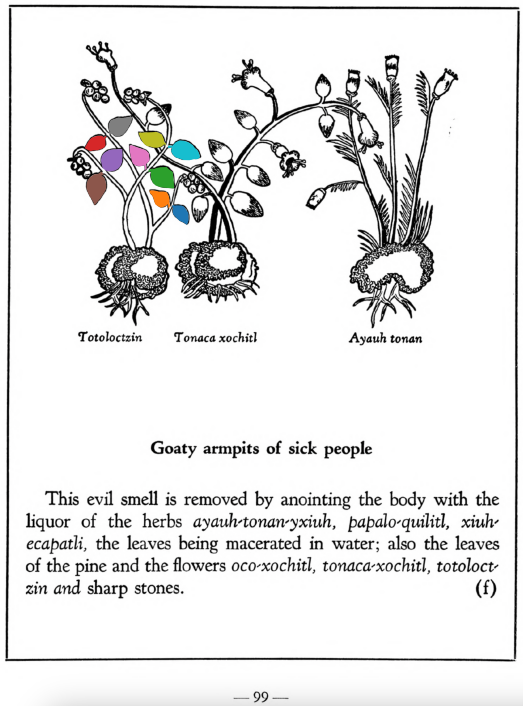

## Subchapter 10f  

=== "English :flag_us:"
    **Goaty armpits of sick people.** This evil smell is removed by anointing the body with the liquor of the herbs [ayauh-tonan-yxiuh](Ayauh-tonan-yxiuh.md), [papalo-quilitl](Papalo-quilitl.md), [xiuh-ecapatli](Eca-patli.md), the leaves being macerated in water; also the leaves of the pine and the flowers [oco-xochitl](Oco-xochitl.md), [tonaca-xochitl](Tonaca-xochitl.md), [totoloctzin](Totoloctzin.md) and sharp stones.  
    [https://archive.org/details/aztec-herbal-of-1552/page/99](https://archive.org/details/aztec-herbal-of-1552/page/99)  

=== "Español :flag_mx:"
    **Axilas de cabra de los enfermos.** Este mal olor se elimina ungiendo el cuerpo con el licor de las hierbas [ayauh-tonan-yxiuh](Ayauh-tonan-yxiuh.md), [papalo-quilitl](Papalo-quilitl.md), [xiuh-ecapatli](Eca-patli.md), maceradas en agua; también con hojas de pino y las flores [oco-xochitl](Oco-xochitl.md), [tonaca-xochitl](Tonaca-xochitl.md), [totoloctzin](Totoloctzin.md) y piedras puntiagudas.  

  
Leaf traces by: Zoë Migicovsky, Acadia University, Canada  
