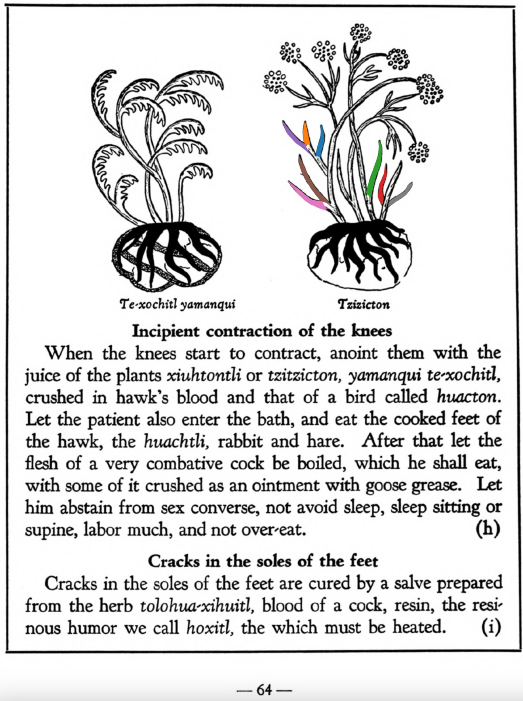
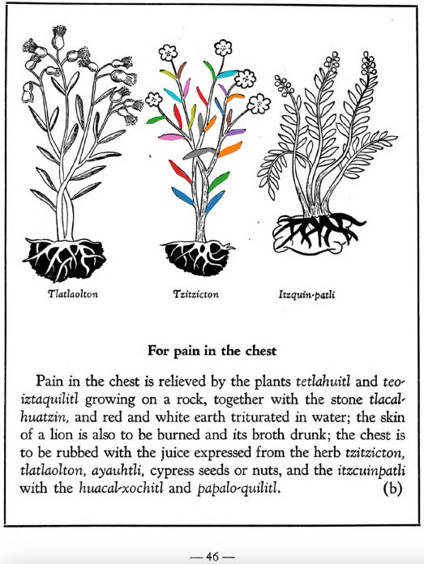

## Subchapter 7b  

=== "English :flag_us:"
    **For pain in the chest.** Pain in the chest is relieved by the plants [tetlahuitl](Tetlahuitl v1.md) and [teo-iztaquilitl](Teo-iztaquilitl.md) growing on a rock, together with the stone [tlacahuatzin](tlacal-huatzin.md), and red and white earth triturated in water; the skin of a lion is also to be burned and its broth drunk; the chest is to be rubbed with the juice expressed from the herb [tzitzicton](Tzitzicton.md), [tlatlaolton](Tlatlaolton.md), [ayauhtli](Ayauhtli.md), cypress seeds or nuts, and the [itzcuinpatli](Itzquin-patli.md) with the [huacal-xochitl](Huacal-xochitl.md) and [papalo-quilitl](Papalo-quilitl.md).  
    [https://archive.org/details/aztec-herbal-of-1552/page/46](https://archive.org/details/aztec-herbal-of-1552/page/46)  

=== "Español :flag_mx:"
    **Para dolor en el pecho.** El dolor en el pecho se alivia con las plantas [tetlahuitl](Tetlahuitl v1.md) y [teo-iztaquilitl](Teo-iztaquilitl.md) que crecen sobre la roca, junto con la piedra [tlacahuatzin](tlacal-huatzin.md), tierra roja y blanca trituradas en agua; también se debe quemar la piel de león y beber su caldo; se debe frotar el pecho con el jugo exprimido de la hierba [tzitzicton](Tzitzicton.md), [tlatlaolton](Tlatlaolton.md), [ayauhtli](Ayauhtli.md), semillas de ciprés o nueces, y el [itzcuinpatli](Itzquin-patli.md) con el [huacal-xochitl](Huacal-xochitl.md) y el [papalo-quilitl](Papalo-quilitl.md).  

## Subchapter 8h  

=== "English :flag_us:"
    **Incipient contraction of the knees.** When the knees start to contract, anoint them with the juice of the plants [xiuhtontli](Xiuhtontli.md) or [tzitzicton](Tzitzicton.md), yamanqui te-xochitl, crushed in hawk’s blood and that of a bird called [huacton](huacton.md). Let the patient also enter the bath, and eat the cooked feet of the hawk, the huachtli, rabbit and hare. After that let the flesh of a very combative cock be boiled, which he shall eat, with some of it crushed as an ointment with goose grease. Let him abstain from sex converse, not avoid sleep, sleep sitting or supine, labor much, and not overheat.  
    [https://archive.org/details/aztec-herbal-of-1552/page/64](https://archive.org/details/aztec-herbal-of-1552/page/64)  

=== "Español :flag_mx:"
    **Contracción incipiente de las rodillas.** Cuando las rodillas comienzan a contraerse, úntalas con el jugo de las plantas [xiuhtontli](Xiuhtontli.md) o [tzitzicton](Tzitzicton.md), yamanqui te-xochitl, trituradas en sangre de halcón y de un ave llamada [huacton](huacton.md). El paciente también debe bañarse y comer los pies cocidos del halcón, el huachtli, conejo y liebre. Después, debe hervirse la carne de un gallo muy combativo, que él deberá comer, y parte de ella se machaca como ungüento con grasa de ganso. Que se abstenga del trato sexual, que no evite dormir, que duerma sentado o acostado boca arriba, que trabaje mucho y que no se sobrecaliente.  

  
Leaf traces by: Mariana Jaired Ruíz Amaro, Laboratory of Agrigenomic Sciences, ENES Unidad León, México  
  
Leaf traces by: Jimena Jazmin Hurtado Olvera, Laboratory of Agrigenomic Sciences, ENES Unidad León, México  
