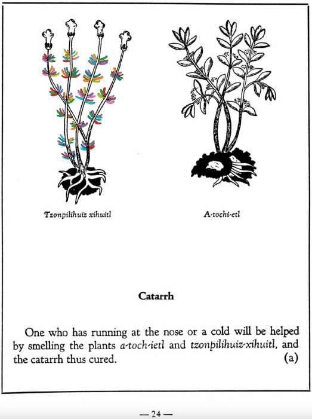

**Variants:**

- tzonpilihuiz-xihuitl

**Morphemes:**

- Tzon/hair
- Xihuitl/herbs, green leaves

## Subchapter 4a  

=== "English :flag_us:"
    **Catarrh.** One who has running at the nose or a cold will be helped by smelling the plants [a-toch-ietl](A-toch-ietl.md) and [tzonpilihuiz-xihuitl](Tzon-pilihuiz-xihuitl.md), and the catarrh thus cured.  
    [https://archive.org/details/aztec-herbal-of-1552/page/24](https://archive.org/details/aztec-herbal-of-1552/page/24)  

=== "Español :flag_mx:"
    **Catarro.** Quien sufre de secreción nasal o resfriado se beneficiará oliendo las plantas [a-toch-ietl](A-toch-ietl.md) y [tzonpilihuiz-xihuitl](Tzon-pilihuiz-xihuitl.md), y así se cura el catarro.  

## Subchapter 7g  

=== "English :flag_us:"
    **Medicine to kill worms.** Let the herbs [tzonpilihuiz-xihuitl](Tzon-pilihuiz-xihuitl.md) and ahhuachcho tonatiuh-yxiuh be ground with frankincense and boiled. Let the broth well cooked be clarified and then drunk, which will get rid of the worms.  
    [https://archive.org/details/aztec-herbal-of-1552/page/51](https://archive.org/details/aztec-herbal-of-1552/page/51)  

=== "Español :flag_mx:"
    **Medicina para matar lombrices.** Las hierbas [tzonpilihuiz-xihuitl](Tzon-pilihuiz-xihuitl.md) y ahhuachcho tonatiuh-yxiuh se trituran con incienso y se hierven. El caldo bien cocido se clarifica y luego se bebe, lo cual eliminará las lombrices.  

  
Leaf traces by: Dan Chitwood, Michigan State University, USA  
