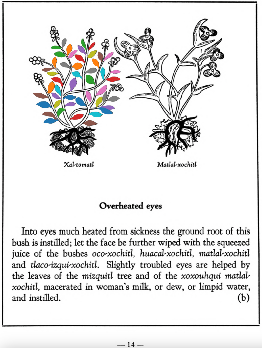

**Morphemes:**

- Tomatl/tomato
- Xal/sand

## Subchapter 5e  

=== "English :flag_us:"
    **Suppuration of roof of mouth and throat.** Suppuration of the roof of the mouth and throat is cured by the root of the [xal-tomatl](Xal-tomatl.md), crushed together with the [te-amoxtli](Te-amoxtli.md), white earth, small or sharp variegated stones that are gathered from a torrent, a-camallo-tetl, with Indian spikes poorly ground, the flowers of the [huacal-xochitl](Huacal-xochitl.md) and [tlaco-izqui-xochitl](Tlaco-izqui-xochitl.md), of which the juice is well squeezed and promptly poured into the throat.  
    [https://archive.org/details/aztec-herbal-of-1552/page/30](https://archive.org/details/aztec-herbal-of-1552/page/30)  

=== "Español :flag_mx:"
    **Supuración del paladar y de la garganta.** La supuración del paladar y de la garganta se cura con la raíz del [xal-tomatl](Xal-tomatl.md), triturada junto con el [te-amoxtli](Te-amoxtli.md), tierra blanca, pequeñas o afiladas piedras multicolores recogidas de un torrente, a-camallo-tetl, con espinas de la India mal molidas, las flores del [huacal-xochitl](Huacal-xochitl.md) y del [tlaco-izqui-xochitl](Tlaco-izqui-xochitl.md), cuyo jugo se exprime bien y se vierte de inmediato en la garganta.  

## Subchapter 9e  

=== "English :flag_us:"
    **Excessive heat.** The body when overheated is relieved by the ground roots of the [huitz-quilitl](Huitz-quilitl.md), [xal-tomatl](Xal-tomatl.md), [tlaca-camotli](Tlaca-camotli.md), [teo-iztaquilitl](Teo-iztaquilitl.md), the stone a-camollotetl, the [eztetl](eztetl.md), [tlacal-huatzin](tlacal-huatzin.md), red earth, white earth, and the stones found in the stomachs of a cock and the [noch-totl](noch-tototl.md), with sharp stones, all then put in water. This is drunk and the abdomen purged with a clyster. A potion is also prepared from [tzayanal-quilitl](Tzayanal-quilitl.md) roots, the [acacapac-quilitl](Aca-capac-quilitl.md), [tol-patlctli](Tol-patlactli.md), the bushes [tetzmitl](Tetzmitl.md), [iztauhyauh](Iztauyattl.md), [huitz-quilitl](Huitz-quilitl.md), with added salt. The body is anointed with the latex squeezed from the [acapac-quilitl](Aca-capac-quilitl.md), [coyo-xihuitl](Coyo-xihuitl.md), [tlal-ecapatli](Tlal-ecapatli.md), [tonatiuh-yxiuh](Tonatiuh yxiuh v1.md), [iztac-oco-xochitl](Iztac oco-xochitl.md), [centzon-oco-xochitl](Centzon-oco-xochitl.md), which are herbs; also using the leaves of the laurel, the bush [tetzmitl](Tetzmitl.md), and the fruit trees [xa-xocotl](Xa-xocotl.md), the plant [cohua-xochitl](Cohua-xochitl.md), leaves of the pine. This medicine is then divided, some poured on the head, some that is quite thick is applied as ointment on the body. If the heat rises, take the blood of the [huitzitzilin](huitzitzilin.md), the gall of the [huexo-canauhtli](huexo-canauhtli.md), the viscera of a quail, bladder of the [cocotli](cocotli.md), skin of the [pezotli](pezotli.md), burned together. These and the above are to be mixed together.  
    [https://archive.org/details/aztec-herbal-of-1552/page/79](https://archive.org/details/aztec-herbal-of-1552/page/79)  

=== "Español :flag_mx:"
    **Calor excesivo.** El cuerpo cuando está sobrecalentado se alivia con las raíces molidas del [huitz-quilitl](Huitz-quilitl.md), [xal-tomatl](Xal-tomatl.md), [tlaca-camotli](Tlaca-camotli.md), [teo-iztaquilitl](Teo-iztaquilitl.md), la piedra a-camollotetl, el [eztetl](eztetl.md), [tlacal-huatzin](tlacal-huatzin.md), tierra roja, tierra blanca, y las piedras encontradas en los estómagos de un gallo y del [noch-totl](noch-tototl.md), con piedras filosas, todo esto se pone en agua. Se bebe esta preparación y el abdomen se purga con un enema. También se prepara una poción con raíces de [tzayanal-quilitl](Tzayanal-quilitl.md), el [acacapac-quilitl](Aca-capac-quilitl.md), [tol-patlctli](Tol-patlactli.md), los arbustos [tetzmitl](Tetzmitl.md), [iztauhyauh](Iztauyattl.md), [huitz-quilitl](Huitz-quilitl.md), con sal añadida. El cuerpo se unta con el látex exprimido del [acapac-quilitl](Aca-capac-quilitl.md), [coyo-xihuitl](Coyo-xihuitl.md), [tlal-ecapatli](Tlal-ecapatli.md), [tonatiuh-yxiuh](Tonatiuh yxiuh v1.md), [iztac-oco-xochitl](Iztac oco-xochitl.md), [centzon-oco-xochitl](Centzon-oco-xochitl.md), que son hierbas; también se usan las hojas de laurel, el arbusto [tetzmitl](Tetzmitl.md), y los árboles frutales [xa-xocotl](Xa-xocotl.md), la planta [cohua-xochitl](Cohua-xochitl.md), hojas de pino. Esta medicina se divide, una parte se vierte en la cabeza, otra más espesa se aplica como ungüento en el cuerpo. Si el calor aumenta, se toma la sangre del [huitzitzilin](huitzitzilin.md), la bilis del [huexo-canauhtli](huexo-canauhtli.md), las vísceras de una codorniz, la vejiga del [cocotli](cocotli.md), la piel del [pezotli](pezotli.md), todo quemado junto. Estos y los anteriores se mezclan.  

## Subchapter 11a  

=== "English :flag_us:"
    **For recent parturition.** If the woman suffers difficulty in the bringing forth, then that she may give forth the fetus with little effort, let her drink medicines made from the bark of the tree [quauh-alahuac](Quauh-alahuac.md) and the plant [cihua-patli](Cihua-patli.md), the small stone [eztetl](eztetl.md), and the tail of the small animal called [tlaquatzin](tlaquatzin.md). Let her hold the plant [tlanextia](Tlanextia xiuhtontli.md) in her hand. Also the hairs and bone of an ape, the wings of an eagle, the tree [a-huexotl](Quetzal-ahuexotl.md), the skin of a deer, gall of a cock, also of a hare, and onions put in the sun are to be burned together; to these are to be added salt, the fruit we call [nochtli](Nochtli.md), and the pulque we call [octli](octli.md). The above are to be heated and used for anointing. Let her eat the cooked flesh of a wolf, and greenstone together with bright green pearl be bound on her back. She may also drink the juice of ground up kite and goose flesh, and the tail of the tlaquauzin, in our sweet wine; also take the root of the [xal-tomatl](Xal-tomatl.md), the tail of the [tlaquatzin](tlaquatzin.md), and leaves of the [cihua-patli](Cihua-patli.md), grind them up, and wet the womb. Also grind the tail of a suckling [tlaquatzin](tlaquatzin.md) in water, with the plant [cihua-patli](Cihua-patli.md), with which let the body be purged, it being given by a clyster.  
    [https://archive.org/details/aztec-herbal-of-1552/page/106](https://archive.org/details/aztec-herbal-of-1552/page/106)  

=== "Español :flag_mx:"
    **Para el parto reciente.** Si la mujer tiene dificultad para dar a luz, para que pueda parir con poco esfuerzo, que beba medicamentos hechos con la corteza del árbol [quauh-alahuac](Quauh-alahuac.md) y la planta [cihua-patli](Cihua-patli.md), la piedrecilla [eztetl](eztetl.md) y la cola del pequeño animal llamado [tlaquatzin](tlaquatzin.md). Que sostenga la planta [tlanextia](Tlanextia xiuhtontli.md) en la mano. También se deben quemar juntos los cabellos y huesos de un mono, las alas de un águila, el árbol [a-huexotl](Quetzal-ahuexotl.md), la piel de un venado, la bilis de un gallo y de una liebre, y cebollas puestas al sol; a esto se le agrega sal, el fruto llamado [nochtli](Nochtli.md) y el pulque llamado [octli](octli.md). Todo lo anterior debe calentarse y usarse para ungir. Que coma la carne cocida de un lobo, y que se le ate en la espalda jade junto con perla de color verde brillante. También puede beber el jugo de milano y carne de ganso molidas, y la cola del tlaquauzin, en nuestro vino dulce; también debe tomarse la raíz del [xal-tomatl](Xal-tomatl.md), la cola del [tlaquatzin](tlaquatzin.md) y las hojas de la [cihua-patli](Cihua-patli.md), molerlas y mojar con ellas el útero. Asimismo, debe molerse la cola de un [tlaquatzin](tlaquatzin.md) lactante en agua con la planta [cihua-patli](Cihua-patli.md), con lo cual debe purgarse el cuerpo, administrándolo en forma de enema.  

  
Leaf traces by: Daniel H. Chitwood, Michigan State University, USA  
