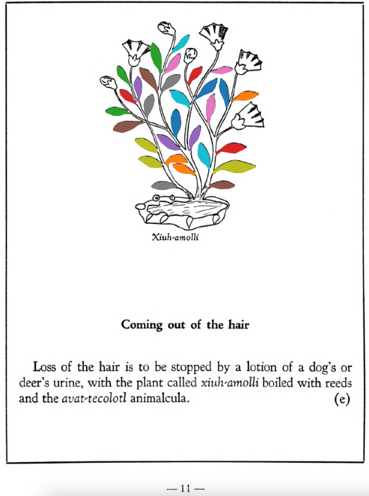

**Morphemes:**

- Xihuitl/herbs, green leaves

## Subchapter 1e  

=== "English :flag_us:"
    **Coming out of the hair.** Loss of the hair is to be stopped by a lotion of a dog’s or deer’s urine, with the plant called [xiuh-amolli](Xiuh-amolli.md) boiled with reeds and the [avat-tecolotl](avat-tecolotl.md) animalcula.  
    [https://archive.org/details/aztec-herbal-of-1552/page/11](https://archive.org/details/aztec-herbal-of-1552/page/11)  

=== "Español :flag_mx:"
    **Caída del cabello.**  La caída del cabello se detiene con una loción de orina de perro o venado, hervida con la planta llamada [xiuh-amolli](Xiuh-amolli.md), junto con cañas y el animalito [avat-tecolotl](avat-tecolotl.md).  

  
Leaf traces by: Daniel H. Chitwood, Michigan State University, USA  
