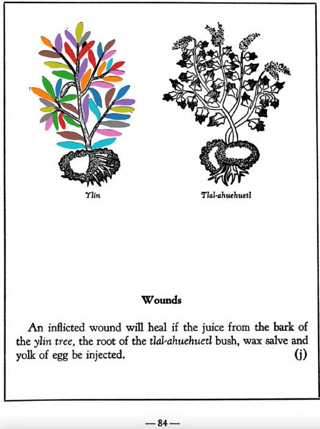

## Subchapter 7k  

=== "English :flag_us:"
    **Dysentery.** The following serve well against dysentery: leaves of the herb [tlacomatl](Tlaco-amatl.md), leaves of the [xa-xocotl](Xa-xocotl.md), almonds, laurel, almond husks, pine bark, the [quetzal-ylin](Quetzal-ylin.md), the [ylin](Ylin.md), [capul-xihuitl](Capul-xihuitl.md) and alectorium, deer’s horn burned to ashes, greens and grain ground up in hot water. The liquor is then to be taken into the rear parts by injection.  
    [https://archive.org/details/aztec-herbal-of-1552/page/53](https://archive.org/details/aztec-herbal-of-1552/page/53)  

=== "Español :flag_mx:"
    **Diarrea disenteriforme.** Contra la disentería sirven bien: hojas de la hierba [tlacomatl](Tlaco-amatl.md), hojas del [xa-xocotl](Xa-xocotl.md), almendras, laurel, cáscaras de almendra, corteza de pino, el [quetzal-ylin](Quetzal-ylin.md), el [ylin](Ylin.md), [capul-xihuitl](Capul-xihuitl.md) y alectorium, cuerno de venado quemado hasta cenizas, verduras y granos triturados en agua caliente. El licor se administra por las partes traseras mediante inyección.  

## Subchapter 9j  

=== "English :flag_us:"
    **Wounds.** An inflicted wound will heal if the juice from the bark of the [ylin](Ylin.md) tree, the root of the [tlal-ahuehuetl](Tlal-ahuehuetl.md) bush, wax salve and yolk of egg be injected.  
    [https://archive.org/details/aztec-herbal-of-1552/page/84](https://archive.org/details/aztec-herbal-of-1552/page/84)  

=== "Español :flag_mx:"
    **Heridas.** Una herida causada sanará si se inyecta jugo de la corteza del árbol [ylin](Ylin.md), raíz del arbusto [tlal-ahuehuetl](Tlal-ahuehuetl.md), ungüento de cera y yema de huevo.  

## Subchapter 9o  

=== "English :flag_us:"
    **Dyspepsia, or difficult digestion.** When any one by reason of overloading the stomach becomes constipated, give him cypress nuts, laurel leaves, the root of the plant [zaca-matlalin](Zaca-matlalin.md), the bark of the blackberry bush, the cherry and the [ylin](Ylin.md) tree, with the root of the [tonatiuh-yxiuh](Tonatiuh yxiuh v1.md), which is red as bright gold. Then crushed together in acid water let them be boiled with honey; the liquor drunk aids wonderfully in clearing the bowels.  
    [https://archive.org/details/aztec-herbal-of-1552/page/89](https://archive.org/details/aztec-herbal-of-1552/page/89)  

=== "Español :flag_mx:"
    **Dispepsia o digestión difícil.** Cuando alguien, por haber sobrecargado el estómago, se constipa, se le dan nueces de ciprés, hojas de laurel, la raíz de la planta [zaca-matlalin](Zaca-matlalin.md), la corteza del arbusto de zarzamora, del cerezo y del árbol [ylin](Ylin.md), con la raíz del [tonatiuh-yxiuh](Tonatiuh yxiuh v1.md), que es roja como el oro brillante. Todo se tritura junto en agua acidulada y se hierve con miel; el licor bebido ayuda maravillosamente a limpiar los intestinos.  

  
Leaf traces by: Lachlann Simms, Acadia University, Canada  
