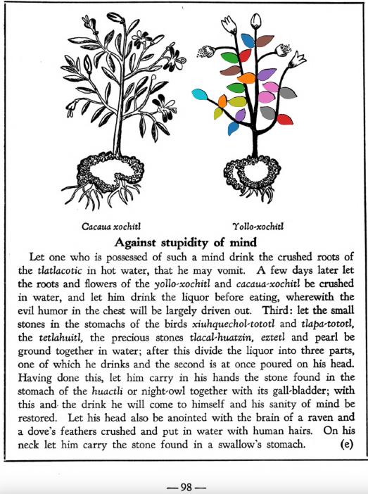

Variants: yollo-xochitl  

## Subchapter 8c  
**The bladder-wort.** When the flow of the urine is shut off, to open it take the roots of the plants [mamaxtla](Mamaxtla.md) and [cohuanene-pilli](Coanenepilli.md), the tlatlauhqui amoxtli, the very white flower [yollo-xochitl](Yollo-xochitl.md), and the tail of a sucking puppy; grind these up in acrid tasting water, macerate the well-known [chian](Chian.md) seed therein, and administer it. The abdomen is also to be washed out with the root of the herb [ohua-xocoyolin](Ohua-xoxocoyolin.md) crushed in hot water, and the juice given through a clyster. If this medicine avails nothing it will be necessary to take the pith of an extremely slender palm, covered with thin cotton and smeared with honey and the crushed root of the herb [huihuitz-mallotic](Huihuitz-mallotic.md), and this cautiously inserted into the virile member. If this is done the stopped urine will be freed.  
[https://archive.org/details/aztec-herbal-of-1552/page/59](https://archive.org/details/aztec-herbal-of-1552/page/59)  

## Subchapter 8d  
**Difficulty in passing the urine.** Against difficulty in urination, a liquor prepared from the flowers [tetzmi-xochitl](Tetzmi-xochitl.md), [tlaco-izqui-xochitl](Tlaco-izqui-xochitl.md), [yollo-xochitl](Yollo-xochitl.md), the[mamaxtla](Mamaxtla.md) root, red earth and [eztetl](eztetl.md), white earth, drunk in water, will be of avail. Also place on the stomach a stone found in the stream, in which pearls (uniones) appear.  
[https://archive.org/details/aztec-herbal-of-1552/page/60](https://archive.org/details/aztec-herbal-of-1552/page/60)  

## Subchapter 10e  
**Against stupidity of mind.** Let one who is possessed of such a mind drink the crushed roots of the [tlatlacotic](Tlatlacotic.md) in hot water, that he may vomit. A few days later let the roots and flowers of the [yollo-xochitl](Yollo-xochitl.md) and [cacaua-xochitl](Cacaua-xochitl.md) be crushed in water, and let him drink the liquor before eating, wherewith the evil humor in the chest will be largely driven out. Third: let the small stones in the stomachs of the birds [xiuhquechol-tototl](xiuh-quechol-tototl.md) and [tlapa-tototl](tlapal-tototl.md), the [tetlahuitl](tetlahuitl v2.md), the precious stones [tlacal-huatzin](tlacal-huatzin.md), [eztetl](eztetl.md) and pearl be ground together in water; after this divide the liquor into three parts, one of which he drinks and the second is at once poured on his head. Having done this, let him carry in his hands the stone found in the stomach of the [huactli](huactli.md) or night-owl together with its gall-bladder; with this and the drink he will come to himself and his sanity of mind be restored. Let his head also be anointed with the brain of a raven and a dove’s feathers crushed and put in water with human hairs. On his neck let him carry the stone found in a swallow’s stomach.  
[https://archive.org/details/aztec-herbal-of-1552/page/98](https://archive.org/details/aztec-herbal-of-1552/page/98)  

## Subchapter 10k  
**The traveler’s protection.** The dried flowers [meca-xochitl](Meca-xochitl.md), [tlil-xochitl](Tlil-xochitl.md), [huey-nacaztli](Huey-nacaztli.md), the bark of the trees [copal-xocotl](Copal-xocotl.md) and [atoya-xocotl](Atoya-xocotl.md), the leaves of the [a-xocotl](A-xocotl.md) tree, white incense, the salve [xochi-ocotzotl](xochi-ocotzotl.md) and[yollo-xochitl](Yollo-xochitl.md), thus crushed and pulverized; then crushed placed within the cavity of the well-known and most fragrant [huacal-xochitl](Huacal-xochitl.md) flower, that they may receive the very redolent odor of this flower, and breathe it out. Then take at the end the highly praised flower [yollo-xochitl](Yollo-xochitl.md), which you must nicely hollow out and therein cover up the health bearing fine powder, suspending the capsule from the neck.  
[https://archive.org/details/aztec-herbal-of-1552/page/104](https://archive.org/details/aztec-herbal-of-1552/page/104)  

  
Leaf traces by: Zoë Migicovsky, Acadia University, Canada  
