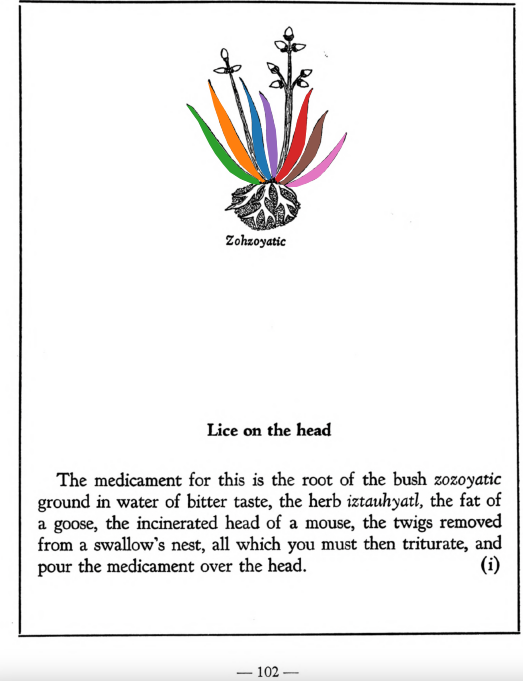

## Subchapter 10i  

=== "English :flag_us:"
    **Lice on the head.** The medicament for this is the root of the bush [zozoyatic](Zozoyatic.md) ground in water of bitter taste, the herb [iztauhyatl](Iztauyattl.md), the fat of a goose, the incinerated head of a mouse, the twigs removed from a swallow’s nest, all which you must then triturate, and pour the medicament over the head.  
    [https://archive.org/details/aztec-herbal-of-1552/page/102](https://archive.org/details/aztec-herbal-of-1552/page/102)  

=== "Español :flag_mx:"
    **Piojos en la cabeza.** El medicamento para esto es la raíz del arbusto [zozoyatic](Zozoyatic.md) molida en agua de sabor amargo, la hierba [iztauhyatl](Iztauyattl.md), la grasa de un ganso, la cabeza incinerada de un ratón, las ramitas extraídas de un nido de golondrina, todo lo cual debe triturarse y verterse sobre la cabeza.  

  
Leaf traces by: Alejandra Rougon-Cardoso, Laboratory of Agrigenomic Sciences, ENES Unidad León, México  
