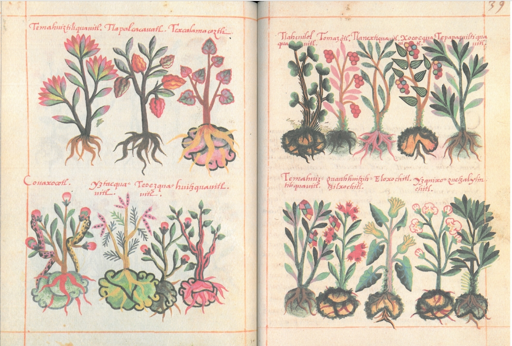

# The De la Cruz-Badiano Nahuatl Herbal (1552) :cactus:  

## *Libellus de Medicinalibus Indorum Herbis*  

[Translation into English](https://en.wikipedia.org/wiki/File:The_De_la_Cruz-Badiano_Aztec_Herbal_of_1552.pdf) by William Gates (1939)

  
From [Wikimedia](https://commons.wikimedia.org/wiki/File:Libellus_de_medicinalibus_Indorum_herbis_ff._38v-39r.jpg)  

=== "English :flag_us:" 

    **Iconography and Indigenous Knowledge in the De la Cruz-Badiano Nahuatl Herbal (1552): A Text Mining and Morphometric Study of Mexican Plants**  
    From *ahuacatl* to *chīlli*, many of the world’s most economically important plants trace their names and cultural significance to Nahuatl, the language of the Mexica and other Indigenous peoples of central Mexico. These words have transcended linguistic boundaries—embedding themselves not only in Spanish but in many languages worldwide—through the global spread of these plants and their culinary and medicinal traditions. This persistence of Nahuatl terminology is more than linguistic: it reflects the enduring Indigenous botanical knowledge systems that resisted and survived European colonization. One of the most remarkable documents preserving this knowledge is the Libellus de Medicinalibus Indorum Herbis, commonly known as the De la Cruz-Badiano Herbal of 1552. This manuscript provides a rare window into a pre-Hispanic classification system, offering plant names in Nahuatl alongside Latin translations and stylized botanical illustrations. In this study, we interpret the Herbal as both a medical manuscript and a repository of Indigenous iconographic data. We present a text mining analysis of the Nahuatl plant names and their Latin counterparts, as well as a morphometric analysis of leaf shapes from the manuscript’s illustrations. Our findings shed light on the structure of Nahua botanical classification and how it reflects cultural, medicinal, and economic understandings of the natural world. By reinterpreting this colonial-era document through computational and visual analysis, we aim to highlight the sophistication of Indigenous botanical knowledge and contribute to ongoing conversations about decolonizing plant science.  

=== "Español :flag_mx:"

    **Iconografía y conocimiento indígena en el herbario náhuatl de De la Cruz-Badiano (1552): Un estudio de minería de texto y morfometría de plantas mexicanas**  
    Desde *ahuacatl* hasta *chīlli*, muchas de las plantas más importantes económicamente en el mundo deben sus nombres y su significado cultural al náhuatl, la lengua de los mexicas y otros pueblos indígenas del centro de México. Estas palabras han trascendido las fronteras lingüísticas—insertándose no solo en el español, sino en muchos idiomas del mundo—gracias a la difusión global de estas plantas y de sus tradiciones culinarias y medicinales. Esta persistencia de la terminología náhuatl es más que lingüística: refleja los sistemas de conocimiento botánico indígena que resistieron y sobrevivieron a la colonización europea. Uno de los documentos más notables que conserva este conocimiento es el *Libellus de Medicinalibus Indorum Herbis*, comúnmente conocido como el Herbario de De la Cruz-Badiano de 1552. Este manuscrito ofrece una rara ventana a un sistema de clasificación prehispánico, al presentar nombres de plantas en náhuatl junto con traducciones al latín e ilustraciones botánicas estilizadas. En este estudio, interpretamos el herbario tanto como un manuscrito médico como un repositorio de datos iconográficos indígenas. Presentamos un análisis de minería de texto de los nombres de plantas en náhuatl y sus equivalentes en latín, así como un análisis morfométrico de las formas de las hojas a partir de las ilustraciones del manuscrito. Nuestros hallazgos arrojan luz sobre la estructura de la clasificación botánica nahua y cómo esta refleja comprensiones culturales, medicinales y económicas del mundo natural. Al reinterpretar este documento de la era colonial mediante análisis computacional y visual, buscamos resaltar la sofisticación del conocimiento botánico indígena y contribuir a las conversaciones actuales sobre la descolonización de la ciencia vegetal.

