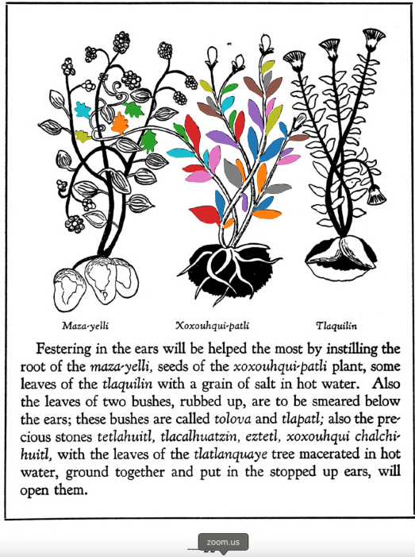
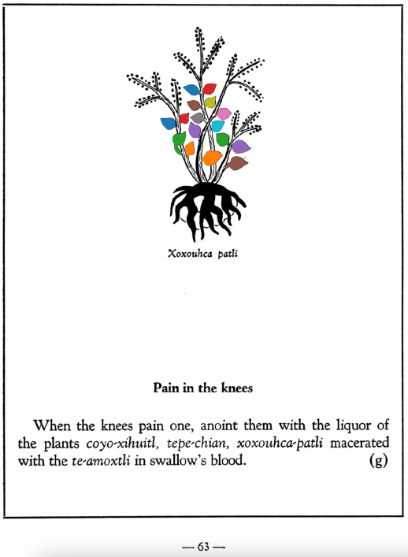

**Variants:**

- quetzal-xoxouhqui
- xoxouhqui-patli

**Morphemes:**

- Patli/medicine
- Xocotl/sour fruit

## Subchapter 3a  

=== "English :flag_us:"
    **On festering in the ears, and deafness or stoppage.** Festering in the ears will be helped the most by instilling the root of the [maza-yelli](Maza-yelli.md), seeds of the [xoxouhqui-patli](xoxouhca-patli.md) plant, some leaves of the [tlaquilin](Tlaquilin.md) with a grain of salt in hot water. Also the leaves of two bushes, rubbed up, are to be smeared below the ears; these bushes are called [tolova](Tolohua xihuitl.md) and [tlapatl](Tlapatl.md); also the precious stones [tetlahuitl](tetlahuitl v2.md), [tlacalhuatzin](tlacal-huatzin.md), [eztetl](eztetl.md), xoxouhqui chalchi-huitl, with the leaves of the [tlatlanquaye](Tlatlanquaye.md) tree macerated in hot water, ground together and put in the stopped up ears, willopen them.  
    [https://archive.org/details/aztec-herbal-of-1552/page/22](https://archive.org/details/aztec-herbal-of-1552/page/22)  

=== "Español :flag_mx:"
    **Sobre la supuración en los oídos, y la sordera u obstrucción.** La supuración en los oídos se alivia sobre todo instilando la raíz del [maza-yelli](Maza-yelli.md), semillas de la planta [xoxouhqui-patli](xoxouhca-patli.md), algunas hojas del [tlaquilin](Tlaquilin.md) con un grano de sal en agua caliente. También deben frotarse bajo las orejas hojas de dos arbustos llamados [tolova](Tolohua xihuitl.md) y [tlapatl](Tlapatl.md); además, las piedras preciosas [tetlahuitl](tetlahuitl v2.md), [tlacalhuatzin](tlacal-huatzin.md), [eztetl](eztetl.md), xoxouhqui chalchi-huitl, con las hojas del árbol [tlatlanquaye](Tlatlanquaye.md) maceradas en agua caliente, todo molido junto y colocado en los oídos tapados, los abrirán.  

## Subchapter 6i  

=== "English :flag_us:"
    **For lameness of the hands.** Lameness of the hands is helped by xoxouhca patli seeds, leaves of the [quetzal-xoxouhqui](xoxouhca-patli.md) and the herb [iztauh-yattl](Iztauyattl.md) crushed and boiled in water. In this liquor further the hands are to be put repeatedly and held a long while. After this bring on ants near whose nest a mouthful of meat or bread has been placed that they may congregate, and let him patiently allow the lame hands to be bitten by their mouth pincers. The hands are to be frequently soaked in the said liquor, and then wrapped in a napkin.  
    [https://archive.org/details/aztec-herbal-of-1552/page/43](https://archive.org/details/aztec-herbal-of-1552/page/43)  

=== "Español :flag_mx:"
    **Para la parálisis de las manos.** La parálisis de las manos se alivia con semillas del xoxouhca patli, hojas del [quetzal-xoxouhqui](xoxouhca-patli.md) y la hierba [iztauh-yattl](Iztauyattl.md) machacadas y hervidas en agua. En este licor se deben sumergir las manos repetidamente y mantenerlas allí un buen rato. Después se deben atraer hormigas cerca de su nido colocando un bocado de carne o pan para que se reúnan, y que el paciente permita con paciencia que las hormigas muerdan sus manos con sus pinzas. Las manos deben remojarse con frecuencia en el mencionado licor y luego envolverse en una servilleta.  

## Subchapter 8g  

=== "English :flag_us:"
    **Pain in the knees.** When the knees pain one, anoint them with the liquor of the plants [coyo-xihuitl](Coyo-xihuitl.md), [tepe-chian](Tepe-chian.md), [xoxouhca-patli](xoxouhca-patli.md) macerated with the [te-amoxtli](Te-amoxtli.md) in swallow's blood.  
    [https://archive.org/details/aztec-herbal-of-1552/page/63](https://archive.org/details/aztec-herbal-of-1552/page/63)  

=== "Español :flag_mx:"
    **Dolor en las rodillas.** Cuando duelen las rodillas, se deben untar con el licor de las plantas [coyo-xihuitl](Coyo-xihuitl.md), [tepe-chian](Tepe-chian.md), [xoxouhca-patli](xoxouhca-patli.md) maceradas con el [te-amoxtli](Te-amoxtli.md) en sangre de golondrina.  

  
Leaf traces by: Daniel H. Chitwood, Michigan State University, USA  
  
Leaf traces by: Mariana Jaired Ruíz Amaro, Laboratory of Agrigenomic Sciences, ENES Unidad León, México  
